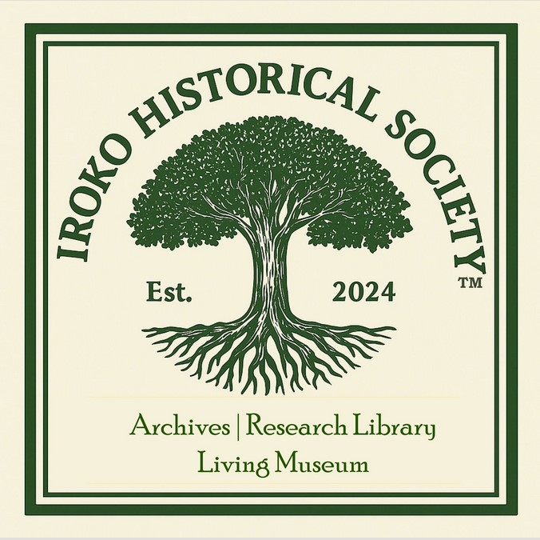

Iroko Historical Society · Postcustodial Digital Archives for Afro-Atlantic Cultural Materials

[
Iroko Historical Society](index.html)
☰

* [Home](index.html)
* [The Society](about.html)
  + [Our Vision](about.html)
  + [The Founder](founder.html)
  + [Our Stance](our-stance.html)
  + [Contact](contact.html)
* [The Collections](collections.html)
  + [Our Holdings](collections.html)
  + [Access & Use Policy](access-policy.html)
  + [Mission & Stewardship](mission.html)
  + [Per Medjat](https://medjat.irokosociety.org/)
  + [Iroko Framework](https://ontology.irokosociety.org/)
* [Research](research.html)
  + [Publications](research.html#peer-reviewed)
  + [Working Papers](research.html#working-papers)
  + [Presentations](research.html#presentations)
* [Iroko](iroko-spirituality.html)
  + [Iroko Spirituality](iroko-spirituality.html)
  + [Visual Ethnography](visual-ethnography.html)
  + [Commentaries](iroko-commentaries.html)
  + [Contribute](contribute-commentary.html)
* [Foundation Day](foundation-day/2026.html)

[Back to Iroko Commentaries](iroko-commentaries.html)

The Iroko Archivist Series · Essay 1
IHS Commentary

# Before the Boxes Disappear

How Ordinary Decisions Unmake a Community Archive

Iroko Commentary · Archives & Stewardship · August 2026

By Délé Fágbèmí Ọ̀.

Community collections rarely disappear in one dramatic act. They are more often unmade by reasonable decisions made under pressure, before anyone has had time to understand what the materials hold together.

A telephone call comes on Thursday afternoon. An elder has passed, a tenant must leave a storage facility, a church is closing, or an organization has lost access to its office. There are books, photographs, correspondence, recordings, financial records, meeting minutes, framed certificates, old computers, and boxes that no one has opened in years. The building must be cleared by Monday.

The caller does not ask how to build an archive. The immediate questions are more basic: what should be saved, where it can go, who has the authority to decide, whether someone can come quickly, and whether any of it is valuable.

By the time those questions are asked, the collection may already be in danger. Relatives may have taken the photographs. Books may have been separated from the papers tucked inside them. Boxes may have been moved without their labels. A volunteer may have discarded duplicates. Someone may have started scanning selected items while leaving the originals in a damp room. A computer may have been unplugged without anyone recording its password or the location of its files.

This is how community memory is commonly lost: not in one dramatic act, but through a sequence of reasonable decisions made under pressure.

## መዝገብ ፩  |  Now What Do We Do?

Three people may receive that Thursday call. One has become responsible for a collection without choosing to be. Another belongs to a community organization that must decide what it can responsibly offer. A third is an archivist, librarian, or historian asked to help without taking control away from the people whose lives produced the records. In many communities these are not three different people.

A community collection is any accumulated body of papers, photographs, recordings, objects, or digital files produced or gathered by a family, congregation, mutual-aid society, neighborhood association, cultural organization, scholar, artist, activist, or local institution. It need not be famous, ancient, or financially valuable. Its importance more often lies in accumulation itself: names repeated across minutes and photographs, correspondence behind an event, receipts showing how an institution survived, annotations in books, or the relationship between a recording and the program that identifies its performers.

An anonymized account shared publicly on social media illustrates how quickly long-term stewardship can become an immediate logistical problem.[1](#note-1) The caretaker of a collection associated with a deceased cultural leader asked volunteers to help move drums, textiles, costumes, and other materials from one storage unit to another. The purpose was not to arrange or preserve the collection. It was to reduce an increasingly unaffordable monthly expense.

The collection had not been abandoned. One person had continued paying to protect it for several years, and the labor that kept the materials from being discarded had become financially difficult to sustain. The proposed move could provide temporary relief, but it could not answer the larger questions: what the collection contained, which materials belonged together, who held authority to make long-term decisions, and what kind of stewardship could last.

The emergency did not begin when volunteers were asked to move the boxes. It had been developing for as long as the collection's future depended on one person's ability to keep paying for its temporary survival.

## መዝገብ ፪  |  Collections Rarely Disappear All at Once

The public image of archival loss is catastrophic: fire, flood, hurricane, mold, insects, or deliberate destruction. Yet many community collections disappear without a disaster. A box thrown into a dumpster is an obvious loss. A box moved six times is harder to recognize as one, although every move creates another opportunity for labels to fall away, folders to become mixed, and parts of the collection to be distributed.

Physical survival can conceal archival loss. Photographs remain, but no one knows who appears in them. Correspondence survives without the envelopes that established dates and addresses. Books remain after inserted letters, programs, and notes have been removed. Meeting minutes survive while the membership lists and event records that explain them are discarded as routine paperwork.

Digital materials disappear in equally ordinary ways. A phone is traded in. An email account is closed. A domain expires. A cloud subscription lapses. A hard drive remains, but the cable or software needed to read it is lost. Files are copied into a single folder, stripping away the directory structure that showed how their creator organized the work. Passwords remain in one person's memory. The Library of Congress advises people preserving digital photographs to identify where files are located, decide what should be saved, organize the material, and maintain copies in different places.[2](#note-2) The guidance is simple because many failures are simple: people do not know what they have, where it is, or whether another usable copy exists.

Collections also disappear through selection. Families save what looks special and discard calendars, drafts, receipts, rosters, routine correspondence, and multiple versions, even though such materials often reveal how people worked, gathered, raised money, sustained relationships, and responded to change. The issue is not that every receipt must survive. It is that permanent selection should not occur before anyone understands the collection as a whole.

## መዝገብ ፫  |  The Predictable Moments of Risk

Collection emergencies are often presented as unforeseeable, but their six most common transitions are not. Three arrive through people: death or incapacity, relocation or downsizing, and organizational closure or leadership change. Three arrive through infrastructure: loss of storage, technological transition, and environmental damage.

The date may be unknown while the transition itself is entirely predictable. People age. Leaders leave. Organizations move or close. Storage costs rise. Technology becomes obsolete. Families settle estates. Each transition can transfer responsibility from someone who knows the materials to someone who does not, often at the same moment that grief, money, space, or a deadline makes rapid selection seem necessary.

Water, heat, pests, and mold can turn an administrative problem into a physical emergency. Preservation guidance therefore emphasizes advance planning, rough inventories, named response responsibilities, and recovery procedures before a collection becomes wet or unsafe to handle.[3](#note-3) A household or community organization does not need a professional archival program. It does need a minimal continuity plan before one of these transitions occurs.

## መዝገብ ፬  |  Why Importance Is Difficult to See

People often ask an archivist, historian, or librarian to identify the valuable things. The question usually combines monetary value, sentimental value, legal importance, historical significance, uniqueness, and research potential. These values do not always overlap. A signed photograph may have market value but reveal little about an organization. Routine correspondence may have no market value but preserve the only account of how a community institution operated. An old ledger may seem dull until it reveals patterns of membership, credit, employment, migration, or mutual assistance.

Archival appraisal is the professional process of deciding which materials have sufficient continuing value to preserve, not simply a search for attractive or exceptional objects. Arrangement likewise attempts to retain provenance and original order so that records keep the context of their creation.[4](#note-4)

A person confronting a newly discovered collection does not need to perform formal appraisal. The initial responsibility is more modest: avoid destroying evidence before informed appraisal can occur. A relative may know the people involved but not the collection's research value. An archivist may recognize a record series but not the cultural significance of particular names or restrictions. A repository may value some materials yet be unable to accept the whole. A provisional decision can be revised. A destructive one cannot.

## መዝገብ ፭  |  Reversibility Is the First Response

The first responsibility in an archival emergency is not to sort, scan, or move quickly. It is to preserve enough context, authority, and living knowledge for the next decision to remain reversible.

That begins with a pause. Disposal and distribution stop long enough to document what exists. Existing groupings remain together. The people involved identify who owns the materials, who holds custody, who can authorize action, and whose privacy or cultural authority must also be considered. Those forms of authority can overlap without being identical. A person may possess a box without owning its contents, own a letter without holding its copyright, or hold legal title without having the standing to decide how sacred knowledge should circulate.

The aim is not to solve every question before the deadline. It is to prevent activity from being mistaken for progress. Moving, boxing, sorting, and scanning can make a collection less intelligible unless each action records what changed, what moved, and who authorized it.

Practical companion

### Before Anything Is Moved

The Medjat first-response guide turns this principle into a chronological checklist for caretakers, families, congregations, and community organizations facing an urgent move, closure, or storage deadline.

[Open the first-response guide](https://medjat.irokosociety.org/archives/first-response/)

## መዝገብ ፮  |  Scanning Is Not a Rescue Plan

We will scan everything is attractive because it sounds decisive, modern, and democratic. It promises to reduce physical storage, create copies for relatives, and make materials accessible. Scanning can support rescue, but it is not a rescue plan in itself.

A scan does not identify the people in a photograph. It does not preserve the relationship between a letter and its envelope unless both are captured and linked. It does not establish ownership or copyright. It does not determine whether a file is complete, authentic, restricted, or safe to share. It does not guarantee that the digital copy will remain usable.

Files may be captured at low resolution, compressed, cropped, mislabeled, or stored on a single drive. A study of a Colorado community archive found that many scan-and-return images created over several years were too poor for later preservation use, while some returned originals could no longer be located for rescanning. The authors argue that community digitization requires high-quality capture, provenance documentation, digital preservation, and sustainable collaboration.[5](#note-5)

One example from our own practice shows the alternative. In 2025 the Iroko Historical Society began work with the holder of a working religious library, a collection assembled over decades for use rather than for research and containing material that is not appropriate for open circulation. At the owner's request, identifying details are withheld.

The arrangement began by declining the obvious one. The collection did not move, and custody did not transfer. The Society supplied infrastructure and method: non-invasive capture, a low-cost catalog under the owner's control, and description written with him present rather than reconstructed afterward. Restrictions were recorded item by item at the moment of digitization, in his words and on his authority, because the question of what may circulate and to whom is not one an outside party can answer later from the object alone.

The transferable part is not the technology, which will change. It is the sequence. The inventory and the restrictions were created while the person who understood the collection was standing beside it. That is the one condition that cannot be reproduced after the fact.

## መዝገብ ፯  |  Continuity Before Crisis

A collection does not need to wait for an emergency. A one-page continuity plan can identify what the collection is, where its physical and digital parts are located, who holds authority, who understands its contents, who is responsible now, what risks already exist, and who must be contacted before anything is moved or divided.

This is not a deed of gift, finding aid, estate plan, or emergency response manual. It is a bridge between the current caretaker and the next decision-maker. The plan should accompany a rough inventory and photographs of the collection's arrangement. More than one responsible person should know where it is. Sensitive information should be secured, but it should not depend on one person's memory.

The value of the plan is not bureaucratic. It prevents the next caretaker from beginning at zero.

## መዝገብ ፰  |  What Community Organizations Can Do

Community organizations do not need to accept permanent custody in order to reduce archival loss. They can make a first-response sheet available, offer inventory and continuity-plan templates, maintain a referral list, and train volunteers to document collections in place before moving them. They can establish a standard emergency conversation that creates time without promising storage, acquisition, or conservation services the organization cannot sustain.

They can also normalize planning. Families prepare wills, insurance records, and emergency contacts while rarely including papers, recordings, websites, and digital accounts. Organizations create budgets and succession plans while leaving their documentary history dependent on a founder or longtime volunteer.

An effective community archival organization can make one question routine: what happens to these materials when the person caring for them no longer can? Collections may remain with families, stay with their creating organizations, enter digitization partnerships, or transfer to repositories. Those choices raise questions of ownership, trust, stewardship, and entrustment that later essays in this series will address.

## መዝገብ ፱  |  Begin While Someone Still Knows

The most endangered part of a community collection is often not the oldest photograph or most fragile document, but the living knowledge that surrounds it. Someone knows why the books were arranged that way, who used the unfamiliar nickname, why a folder marked miscellaneous holds the most important correspondence, which organization changed its name, which event was never publicly announced, which recording should not be shared, and which apparent duplicate carries the only handwritten correction.

That knowledge was rarely written down because the collection was created for use rather than for future researchers. When its caretaker dies, moves, becomes ill, or simply forgets, the papers may remain while their meaning quietly recedes.

Preservation must therefore begin while someone still knows: the questions asked before the move, the shelves photographed before the books come down, the labels recorded before the boxes are replaced, the people identified before the images are shared, the accounts listed before the subscription lapses, the inventory made before a crisis turns every decision urgent.

Not every collection can be kept in full. Not every collection belongs in an institution. Not every family or organization can build an archive. Almost anyone, however, can delay irreversible action long enough to document what exists, reduce immediate risk, and place responsibility in named hands.

The telephone call still comes on a Thursday afternoon. What determines whether it finds a rescue or a loss is not the disaster itself but everything that was, or was not, done before it: the labels kept, the names recorded, the authority established, the plan written while someone still remembered.

Saving a community collection begins before the boxes are gone.

## Notes

1. Anonymized public social-media account describing the relocation of a deceased cultural leader's collection between storage units. Identifying details are withheld to protect the people involved. Post on file with the author. [↩](#ref-1)
2. Library of Congress, [“Digital Photos,”](https://digitalpreservation.gov/personalarchiving/photos.html) Personal Archiving, accessed August 30, 2026. [↩](#ref-2)
3. Northeast Document Conservation Center, [“3.3 Emergency Planning,”](https://www.nedcc.org/free-resources/preservation-leaflets/3.-emergency-management/3.3-emergency-planning) Preservation Leaflets, accessed August 30, 2026. [↩](#ref-3)
4. Society of American Archivists, *Dictionary of Archives Terminology*, s.vv. “Appraisal,” “Provenance,” “Original Order,” “Arrangement,” accessed August 30, 2026, [dictionary.archivists.org](https://dictionary.archivists.org/). [↩](#ref-4)
5. Krystyna K. Matusiak and A. R. Flynn, “Sustaining Community Archives in the Post-Custodial Digital Environment,” *Preservation, Digital Technology & Culture* 54, no. 2 (2025): 167–76, <https://doi.org/10.1515/pdtc-2025-0018>. [↩](#ref-5)

## Further reading

National Archives and Records Administration. "How to Preserve Family Archives." Accessed August 30, 2026. <https://www.archives.gov/preservation/family-archives>.

National Archives and Records Administration. "Preserving Family Photos." *Prologue*, Fall 2015. <https://www.archives.gov/publications/prologue/2015/fall/handling-photos.html>.

Northeast Document Conservation Center. "3.8 Emergency Salvage of Moldy Books and Paper." Preservation Leaflets. Accessed August 30, 2026. <https://www.nedcc.org/free-resources/preservation-leaflets/3.-emergency-management/3.8-emergency-salvage-of-moldy-books-and-paper>.

Society of American Archivists. "Donating Your Personal or Family Records to a Repository." Accessed August 30, 2026. <https://www2.archivists.org/publications/brochures/donating-familyrecs>.

Society of American Archivists. "A Guide to Deeds of Gift." Accessed August 30, 2026. <https://www2.archivists.org/publications/brochures/deeds-of-gift>.

## Suggested citation

Fágbèmí Ọ̀., Délé. “Before the Boxes Disappear: How Ordinary Decisions Unmake a Community Archive.” *The Iroko Archivist Series*, essay 1. Iroko Historical Society, 2026. https://irokosociety.org/before-the-boxes-disappear.html.

## Publication record

Series
:   The Iroko Archivist Series

Essay
:   1

Classification
:   IHS Commentary

Published
:   August 2026

Original language
:   English

Rights
:   © 2026 Iroko Historical Society

Practical companion
:   [Before Anything Is Moved](https://medjat.irokosociety.org/archives/first-response/)

## Editorial notice

This is a signed commentary by an IHS author. Personal authorship remains distinct from official institutional statement. The linked Medjat guide is practical institutional guidance and may be revised as preservation practice and IHS capacity develop.

## Comments

We welcome substantive responses to these essays. Sign in with GitHub to comment. Disagreement is welcome; personal attacks, bad-faith provocation, and uninvited pastoral correction are not.

#### Iroko Historical Society

A postcustodial cultural heritage complex comprising a digital archive, research library, and living museum focused on Afro-Atlantic sacred knowledge systems.

New Orleans-founded · Afro-Atlantic archives and research · Est. 2024

#### Navigate

[About the Society](about.html)
[Our Holdings](collections.html)
[Access Policy](access-policy.html)
[Mission & Stewardship](mission.html)
[Research & Scholarship](research.html)
[Visual Ethnography](visual-ethnography.html)
[Iroko Commentaries](iroko-commentaries.html)
[Contact](contact.html)

#### Per Medjat & Framework

[Per Medjat ↗](https://medjat.irokosociety.org/)
[First-Response Guide ↗](https://medjat.irokosociety.org/archives/first-response/)
[Ontology ↗](https://ontology.irokosociety.org/)
[White Paper ↗](https://ontology.irokosociety.org/whitepaper)
[Zenodo DOI ↗](https://doi.org/10.5281/zenodo.18826673)

© 2024–2026 Iroko Historical Society · Ilé Aña Olofí, Inc. All rights reserved.

Vocabulary published under CC0 1.0 Universal · [protected]